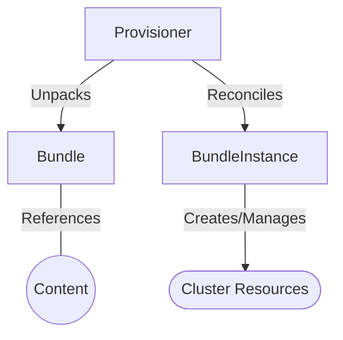

[](http://www.apache.org/licenses/LICENSE-2.0.html)
[](https://kubernetes.slack.com/archives/C0181L6JYQ2)

# RukPak

RukPak runs in a Kubernetes cluster and defines an API for installing cloud native bundle content.

## Introduction

RukPak is a pluggable solution for the packaging and distribution of cloud-native content and supports advanced
strategies for installation, updates, and policy. The project provides a content ecosystem for installing a variety of
artifacts, such as Git repositories, Helm charts, OLM bundles, and more onto a Kubernetes cluster. These artifacts can
then be managed, scaled, and upgraded in a safe way to enable powerful cluster extensions.

At its core, RukPak is a small set of APIs, packaged as Kubernetes CustomResourceDefinitions, and controllers that watch
for those APIs. These APIs express what content is being installed on-cluster and how to create a running instance of
the content.

## Contributing

The RukPak project is community driven and is part of the broader Kubernetes ecosystem. New contributors are welcome and
highly encouraged. See the [contributing guidelines](CONTRIBUTING.md) to get started.

## Components

RukPak is composed of two primary APIs, [Bundle](#bundle) and [BundleInstance](#bundleInstance), as well as the concept
of a [Provisioner](#provisioner). These components work together to bring content onto the cluster and install it,
generating resources within the cluster. Below is a high level diagram depicting the interaction of the RukPak
components.



A provisioner places a watch on both Bundles and BundleInstances that refer to it explicitly. For a given bundle, the
provisioner unpacks the contents of the Bundle onto the cluster. Then, given a BundleInstance referring to that Bundle,
the provisioner then installs the bundle contents and is responsible for managing the lifecycle of those resources.

### Bundle

A `Bundle` represents content that needs to be made available to other consumers in the cluster. Much like the contents
of a container image need to be pulled and unpacked in order for Pods to start using them,
`Bundles` are used to reference content that may need to be pulled and should be unpacked. In this sense, Bundle is a
generalization of the image concept, and can be used to represent any type of content.

`Bundles` do nothing on their own - they require a `Provisioner` to unpack and make their content available in-cluster.
They can be unpacked to any arbitrary storage medium such as a series of ConfigMaps. Each `Bundle` has an
associated `spec.provisionerClassName` field which indicates the `Provisioner` that should be watching and unpacking
that particular bundle type.

Example Bundle configured to work with the [plain provisioner](internal/provisioner/plain/README.md).

```yaml
apiVersion: core.rukpak.io/v1alpha1
kind: Bundle
metadata:
  name: my-bundle
spec:
  source:
    type: image
    image:
      ref: my-bundle@sha256:xyz123
  provisionerClassName: core.rukpak.io/plain
```

### BundleInstance

The `BundleInstance` API points to a Bundle and indicates that it should be “active”. This includes pivoting from older
versions of an active bundle.`BundleInstance` may also include an embedded spec for a desired Bundle.

Much like Pods stamp out instances of container images, `BundleInstances` stamp out an instance of
Bundles. `BundleInstance` can be seen as a generalization of the Pod concept.

The specifics of how an `BundleInstance` makes changes to a cluster based on a referenced `Bundle` is defined by the
`Provisioner` that is configured to watch that `BundleInstance`.

Example BundleInstance configured to work with the [plain provisioner](internal/provisioner/plain/README.md).

```yaml
apiVersion: core.rukpak.io/v1alpha1
kind: BundleInstance
metadata:
  name: my-bundle-instance
spec:
  bundleName: my-bundle
  provisionerClassName: core.rukpak.io/plain
```

### Provisioner

A Provisioner is a controller that understands `BundleInstance` and `Bundle` APIs and can take action.
Each `Provisioner` is assigned a unique ID, and is responsible for reconciling a `Bundle` and `BundleInstance` with
a `spec.provisionerClassName` that matches that particular ID.

For example, in this repository the [plain](internal/provisioner/plain/README.md) provisioner is implemented.
The `plain` provisioner is able to unpack a given `plain+v0` bundle onto a cluster and then instantiate it, making
the content of the bundle available in the cluster.
