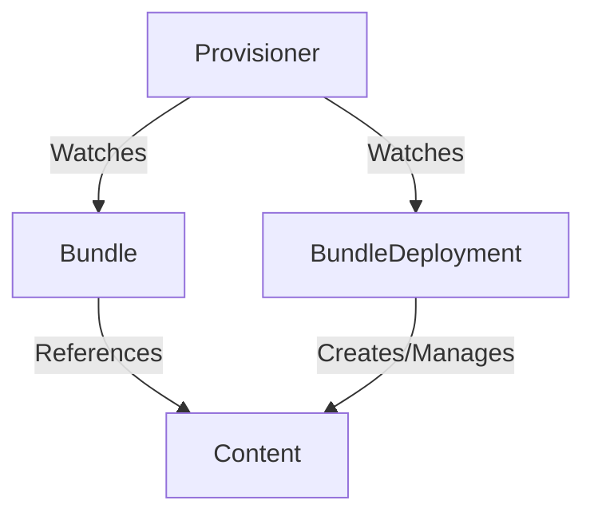

# Provisioners

The following subdirectories contain concrete Provisioner implementations.

- [plain](plain.md) - provisions `plain+v0` k8s bundles
- [registry](registry.md) - provisions `registry+v1` OLM bundles
- [helm](helm.md) - provisions `helm+v3` helm bundles-

## Global Provisioner Concepts

### Using provisioners to install bundle content
RukPak comes built-in with the concept of provisioners. Provisioners are pluggable controllers that understand how to unpack and install
`Bundle`s and `BundleDeployment`s that specify they are in the provisioner's expected format.



Each provisioner has its own custom logic for how it goes about handling content. Using a specific provisioner is done by specifying the `provisionerClassName` property in the spec of either the `Bundle` or `BundleDeployment` api. Here is an example of this concept in an embedded `BundleDeployment`.

```yaml
apiVersion: core.rukpak.io/v1alpha1
kind: BundleDeployment
metadata:
  name: my-bundle-deployment
spec:
  provisionerClassName: core.rukpak.io/my-provisioner # <-- Provisioner for the BundleDeployment
  template:
    metadata:
      labels:
        app: my-bundle
    spec:
      source:
        type: image
        image:
          ref: my-bundle@sha256:xyz123
      provisionerClassName: core.rukpak.io/my-provisioner # <-- Provisioner for the Bundle
```

### Pivoting between bundle versions

The `BundleDeployment` API is meant to indicate the version of the bundle that should be active within the cluster.

Given an existing BundleDeployment resource in the cluster, which contains an embedded Bundle template for the
`my-bundle-v0.0.1` bundle, you can modify the desired specification and a provisioner will automatically generate
a new `my-bundle-v0.0.2` Bundle matching that template.

When the new Bundle resource has been rolled out successfully, the old `my-bundle-v0.0.1` Bundle will be deleted from the cluster.

Provisioners also continually reconcile the created content via dynamic watches to ensure that all
resources referenced by the bundle are present on the cluster.

### Make bundle content available but do not install it

There is a natural separation between sourcing of the content and application of that content via two separate RukPak
APIs, `Bundle` and `BundleDeployment`. A user can specify a particular `Bundle` to be available in the cluster for
inspection before any application of the resources. Given a `Bundle` resource named `my-bundle`, a provisioner
will pull down and unpack the bundle to a tar.gz file that is saved using the provisioner's internal storage mechanism.

By default, RukPak's built-in provisioners and other core resources are deployed into the `rukpak-system` namespace.

The content of a bundle can be queried using the `status.contentURL`, assuming you have the necessary
RBAC permissions to access bundle content.

As an example, a client outside the cluster can view the file contents from a bundle named `my-bundle` by running
the following script:

> Note: This script requires Kubernetes 1.24+ for both client and server

```bash
BUNDLE_NAME=my-bundle

kubectl create sa fetch-bundle -n default
kubectl create clusterrolebinding fetch-bundle --clusterrole=bundle-reader --serviceaccount=default:fetch-bundle
export TOKEN=$(kubectl create token fetch-bundle)
export URL=$(kubectl get bundle $BUNDLE_NAME -o jsonpath='{.status.contentURL}')
kubectl run -qit --rm -n default --restart=Never fetch-bundle --image=curlimages/curl --overrides='{ "spec": { "serviceAccount": "fetch-bundle" }  }' --command -- curl -sSLk -H "Authorization: Bearer $TOKEN" -o - $URL | tar ztv
kubectl delete clusterrolebinding fetch-bundle
kubectl delete sa fetch-bundle -n default
```

Simplifying the process of fetching this bundle content (e.g. via a plugin) is on the RukPak roadmap.

## Provisioner Spec [DRAFT]

A provisioner is a controller responsible for reconciling `Bundle` and/or `BundleDeployment` objects using
provisioner-specific logic, but with a consistent API. This provisioner concept is inspired by and therefore very
similar to native Kubernetes's `Ingress` API and the ecosystem of ingress controllers.

The idea of a provisioner is to unpack bundle content and install that bundle content onto a cluster, and the
provisioner abstraction enables variations of bundle format and install/upgrade techniques to be implemented under a
single API.

In order for bundle consumers and producers to be able to treat bundles and bundle deployments homogeneously, all
provisioners must include certain functionality and capabilities.

### Terminology
| Term              | Description                                                |
|-------------------|------------------------------------------------------------|
| **Bundle Source** | A protocol that provisioners use to fetch bundle contents. |
| **Bundle Format** | A schema that describes the contents of a bundle.          |


### Requirements

1. A provisioner _must_ define one or more globally unique names for the `Bundle` and `BundleDeployment` controllers it
runs. For the purposes of provisioner class name references, this name must also conform to the
[DNS label schema](https://kubernetes.io/docs/concepts/overview/working-with-objects/names/#dns-label-names) as defined
in RFC 1123.
2. A provisioner _should_ use its unique controller names when configuring its watch predicates so that it only
reconciles bundles and bundle deployments that use its name.
3. A provisioner is not required to implement controllers for both bundles and bundle deployments.
   - There may be use cases where a `Bundle` provisioner fetches a bundle in one format and converts it to another
     format such that a different `BundleDeployment` provisioner can be used to install it.
   - There may also be use cases where different provisioners exist for to provide implementation variations for the
     same bundle formats. For example, two different provisioners that handle plain manifest bundles: one that performs
     "atomic" upgrades and one tha performs eventually consistent upgrades.
4. A provisioner _must_ reuse the defined condition types and phases when updating the status of bundles and bundle deployments.
5. A provisioner _should_ populate all condition types during every reconciliation, even if that means setting
   `condition.status = "Unknown"`. This enables consumers to avoid making false assumptions about the status of the
   object.
6. A bundle provisioner _must_ populate and update the observed generation in the bundle status such that it reflects
   the `metadata.generation` value.
7. A bundle provisioner _must_ populate the `contentURL` field and host a webserver at which the bundle can be fetched.
   - The webserver _must_ deny unauthorized access to the bundle content.
   - The webserver _must_ allow access to the bundle content via the `bundle-reader` cluster role provided by rukpak.
8. A bundle deployment provisioner _must_ populate and update the `activeBundle` field in the status to reflect the
   currently installed bundle. It is up to the provisioner implementation to define what "installed" means for its
   implementation.
9. A bundle provisioner _should_ implement _all_ concrete source types in the bundle spec. In the event that it does
   not implement a concrete source type, it _must_ populate the `Unpacked` condition with status `False` and reason
  `ReasonUnpackFailed` with a message explaining that the provisioner does not implement the desired source.
10. A bundle deployment provisioner _must_ reconcile embedded bundle objects by:
    - Ensuring that the desired bundle template exists as a `Bundle`
    - Ensuring that the desired bundle has successfully unpacked prior to triggering a pivot to it.
    - Ensuring that previous bundles associated with the bundle deployment are cleaned up as soon as possible after the
      desired bundle has been successfully installed.
