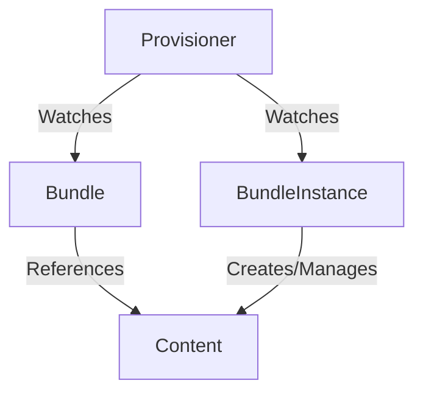

# Plain Provisioner

## Summary

The `plain` provisioner is a core rukpak provisioner that knows how to interact with bundles of a particular format.
These `plain+v0` bundles, or plain bundles, are simply container images containing a set of static Kubernetes YAML
manifests in a given directory. For example, below is an example Dockerfile that builds a plain `plain+v0` bundle from a
directory containing static manifests.

```dockerfile
FROM scratch
COPY /manifests /manifests
```

where the given `manifests` directory contains the Kubernetes resources required to deploy an application, for example:

```
manifests
├── namespace.yaml
├── cluster_role.yaml
├── role.yaml
├── serviceaccount.yaml
├── cluster_role_binding.yaml
├── role_binding.yaml
└── deployment.yaml
```

> Note: The static manifests must be located in the root-level /manifests directory for the bundle image to be a
valid `plain+v0` bundle that the provisioner can unpack.

The `plain` provisioner is able to unpack a given `plain+v0` bundle onto a cluster and then instantiate it, making
the content of the bundle available in the cluster. It does so by reconciling `Bundle` and `BundleInstance` types that
have the `spec.provisionerClassName` field set to `core.rukpak.io/plain`. This field must be set to the correct
provisioner name in order for the `plain` provisioner to see and interact with the bundle.

Below is an example of the provisioner reconciliation flow:



## Use cases

### Install and apply a specific version of a bundle

The `plain` provisioner can install and make available a specific `plain+v0` bundle in the cluster.

Simply create a `Bundle` resource pointing to a specific version of your bundle, and a `BundleInstance` which references
that bundle. The `plain` provisioner will unpack the provided Bundle onto the cluster, and eventually make the
content available on the cluster.

```yaml
apiVersion: core.rukpak.io/v1alpha1
kind: Bundle
metadata:
  name: my-bundle
spec:
  image: my-bundle@sha256:xyz123
  provisionerClassName: core.rukpak.io/plain
---
apiVersion: core.rukpak.io/v1alpha1
kind: BundleInstance
metadata:
  name: my-bundle-instance
spec:
  provisionerClassName: core.rukpak.io/plain
  bundleName: my-bundle
```

First, the Bundle will be in the Pending stage as the provisioner sees it and begins unpacking the referenced content:

```
NAME          IMAGE                                        PHASE     AGE
my-bundle     my-bundle@sha256:xyz123                      Pending   3s
```

Then eventually, as the bundle content is unpacked onto the cluster via the defined storage mechanism, the bundle status
will be updated to Unpacked, indicating that all its contents have been stored on-cluster.

```
NAME          IMAGE                                        PHASE      AGE
my-bundle     my-bundle@sha256:xyz123                      Unpacked   10s
```

Now that the bundle has been unpacked, the provisioner is able to create the resources in the bundle on the cluster.
These resources will be owned by the corresponding BundleInstance. Creating the BundleInstance on-cluster results in an
InstallationSucceeded Phase if the application of resources to the cluster was successful.

```
NAME                 DESIRED BUNDLE   INSTALLED BUNDLE   INSTALL STATE           AGE
my-bundle-instance   my-bundle        my-bundle          InstallationSucceeded   11s
```

> Note: Creation of more than one BundleInstance from the same Bundle will likely result in an error.

### Make bundle content available but do not install it

There is a natural separation between sourcing of the content and application of that content via two separate RukPak
APIs, `Bundle` and `BundleInstance`. A user can specify a particular `Bundle` to be available in the cluster for
inspection before any application of the resources. Given a `Bundle` resource named `my-bundle`, the plain
provisioner will pull down and unpack the bundle to a set of ConfigMaps.

By default, `rukpak-system` is the configured namespace for deploying `plain` provisioner-related system resources.

Surfacing the content of a bundle in a more user-friendly way, via a plugin or additional API, is on the RukPak roadmap.

### Pivoting between bundle versions

The `BundleInstance` API is meant to indicate the version of the bundle that should be active within the cluster. Given
two unpacked bundles in the cluster,
`my-bundle-v0.0.1` and `my-bundle-v0.0.2`, the `spec.bundleName` field of the related `BundleInstance` can be updated to
pivot to a different version. For example by pivoting from an older version, to the newer version, by updating
the `spec.bundleName` field the `plain` provisioner will create the new bundle content on-cluster and remove the old
content. The provisioner also continually reconciles the created content via dynamic watches to ensure that all
resources referenced by the bundle are present on the cluster.

## Running locally

### Setup

To experiment with the `plain` provisioner locally, first setup a local cluster, or simply
have [kind](https://kind.sigs.k8s.io/) installed locally.

Once the cluster has been setup, take the following steps:

* Clone the repository via `git clone https://github.com/operator-framework/rukpak`
* Navigate to the repository via `cd rukpak`
* Run `make run` to build and deploy the provisioner onto the local cluster.

### Installing the Combo Operator

From there, create some `Bundles` and `BundleInstance` types to see the provisioner in action. For an example bundle to
use, the [combo operator](https://github.com/operator-framework/combo) is a good candidate.

Create the bundle:

```console
$ kubectl apply -f -<<EOF
apiVersion: core.rukpak.io/v1alpha1
kind: Bundle
metadata:
  name: combo-v0.0.1
spec:
  image: quay.io/tflannag/bundle:combo-operator-v0.0.1
  provisionerClassName: core.rukpak.io/plain
EOF
bundle.core.rukpak.io/combo-v0.0.1 created
```

Check the Bundle status via `kubectl get bundle combo-0.0.1`. Eventually the Bundle should show up as Unpacked.

```console
$ kubectl get bundle combo-v0.0.1
NAME           IMAGE                                           PHASE      AGE
combo-v0.0.1   quay.io/tflannag/bundle:combo-operator-v0.0.1   Unpacked   10s
```

Create the combo `BundleInstance` referencing the combo `Bundle` available in the cluster.

Note: it's perfectly valid to create a `Bundle` and `BundleInstance` referencing that `Bundle` at the same time. There
is no specific ordering required, which is perfect for GitOps flows, and eventually both the `Bundle`
and `BundleInstance` would succeed.

```console
$ kubectl apply -f -<<EOF
apiVersion: core.rukpak.io/v1alpha1
kind: BundleInstance
metadata:
  name: combo
spec:
  provisionerClassName: core.rukpak.io/plain
  bundleName: combo-v0.0.1
EOF
bundleinstance.core.rukpak.io/combo created
```

Check the BundleInstance status to ensure that the installation was successful.

```console
$ kubectl get bundleinstance combo
NAME    DESIRED BUNDLE   INSTALLED BUNDLE   INSTALL STATE           AGE
combo   combo-v0.0.1     combo-v0.0.1       InstallationSucceeded   10s
```

From there, check out the combo operator deployment and ensure that the operator is present on the cluster.

```console
$ kubectl -n combo get deployments.apps combo-operator
NAME             READY   UP-TO-DATE   AVAILABLE   AGE
combo-operator   1/1     1            1           10s

$ kubectl -n combo get deployments.apps combo-operator -o yaml | grep 'image:' | xargs
image: quay.io/tflannag/combo:v0.0.1
```

The operator should be successfully installed.

Next, the `plain` provisioner continually reconciles BundleInstance resources. Let's try deleting the combo deployment:

```console
$ kubectl -n combo delete deployments.apps combo-operator
deployment.apps "combo-operator" deleted
```

Check for the deployment again, it will be back on the cluster. The provisioner ensures that all resources required
for the BundleInstance to run are accounted for on-cluster.

### Upgrading the Combo Operator

Let's say the combo operator released a new patch version, and we want to upgrade to that version.

> Note: Currently upgrading a BundleInstance is a manual process that involves updating the spec.BundleName being referenced, and point to a new Bundle's metadata.Name. Automatically pivoting to a new Bundle is on the roadmap.

First, create a new Bundle resource that points to this new plain+v0 bundle container image:

```console
$ kubectl apply -f -<<EOF
apiVersion: core.rukpak.io/v1alpha1
kind: Bundle
metadata:
  name: combo-v0.0.2
spec:
  image: quay.io/tflannag/bundle:combo-operator-v0.0.2
  provisionerClassName: core.rukpak.io/plain
EOF
```

And wait until that Bundle is reporting an Unpacked status:

```console
$ kubectl get bundles combo-v0.0.2
NAME           IMAGE                                           PHASE      AGE
combo-v0.0.2   quay.io/tflannag/bundle:combo-operator-v0.0.2   Unpacked   10s
```

Once the Bundle has been unpacked, update the existing `combo` BundleInstance resource to point to the new `combo-v0.0.2` Bundle:

```console
$ kubectl patch bundleinstance combo --type='merge' -p '{"spec":{"bundleName": "combo-v0.0.2"}}'
bundleinstance.core.rukpak.io/combo patched
```

And verify that the BundleInstance `combo` resource now points to the new Bundle version:

```console
$ kubectl get bundleinstance combo
NAME    DESIRED BUNDLE   INSTALLED BUNDLE   INSTALL STATE           AGE
combo   combo-v0.0.2     combo-v0.0.2       InstallationSucceeded   10s
```

And check that the combo-operator deployment in the combo namespace is healthy and contains a new container image:

```console
$ kubectl -n combo get deployment
NAME             READY   UP-TO-DATE   AVAILABLE   AGE
combo-operator   1/1     1            1           10s

$ kubectl -n combo get deployments.apps combo-operator -o yaml | grep 'image:' | xargs
image: quay.io/tflannag/combo:v0.0.2
```

Notice that the container image has changed since we had first installed the combo operator.

### Deleting the Combo Operator

To cleanup from the installation, simply remove the BundleInstance from the cluster. This will remove all references
resources including the deployment, RBAC, and the operator namespace. Then the Bundle can be removed as well, which
removes any unpacked manifests from the cluster.

```console
$ kubectl delete bundleinstances.core.rukpak.io combo
bundleinstance.core.rukpak.io "combo" deleted

$ kubectl delete bundle combo-v0.0.1
bundle.core.rukpak.io "combo-v0.0.1" deleted

$ kubectl delete bundle combo-v0.0.2
bundle.core.rukpak.io "combo-v0.0.2" deleted
```

The cluster state is now the same as it was prior to installing the operator.
