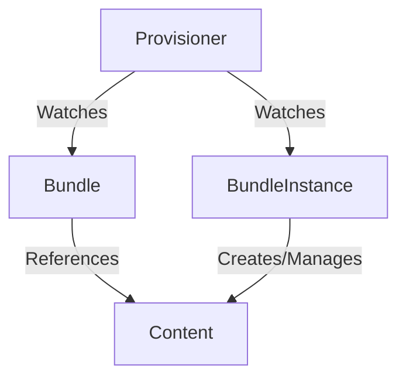

# Plain Provisioner

## Summary

The `plain` provisioner is a core rukpak provisioner that knows how to interact with bundles of a particular format.
These `plain+v0` bundles, or plain bundles, are simply container images containing a set of static Kubernetes YAML
manifests in a given directory. For more information on the `plain+v0` format, see
the [plain+v0 bundle spec](/docs/plain-bundle-spec.md).

The `plain` provisioner is able to unpack a given `plain+v0` bundle onto a cluster and then instantiate it, making the
content of the bundle available in the cluster. It does so by reconciling `Bundle` and `BundleInstance` types that have
the `spec.provisionerClassName` field set to `core.rukpak.io/plain`. This field must be set to the correct provisioner
name in order for the `plain` provisioner to see and interact with the bundle.

Below is an example of the provisioner reconciliation flow:



## Use cases

### Install and apply a specific version of a bundle

> :warning: Anyone with the ability to create or update BundleInstance objects can become cluster admin. It's important
> to limit access to this API via RBAC to only those that explicitly require access, as well as audit your bundles to
> ensure the content being installed on-cluster is as-expected and secure.

The `plain` provisioner can install and make available a specific `plain+v0` bundle in the cluster.

Simply create a `BundleInstance` resource that contains the desired specification of a Bundle resource.
The `plain` provisioner will unpack the provided Bundle onto the cluster, and eventually make the content
available on the cluster.

```yaml
apiVersion: core.rukpak.io/v1alpha1
kind: BundleInstance
metadata:
  name: my-bundle-instance
spec:
  provisionerClassName: core.rukpak.io/plain
  template:
    metadata:
      labels:
        app: my-bundle
    spec:
      source:
        type: image
        image:
          ref: my-bundle@sha256:xyz123
      provisionerClassName: core.rukpak.io/plain
```

> Note: the generated Bundle will contain the BundleInstance's metadata.Name as a prefix, following
> a randomized value to prevent collisions with other Bundle resources.

First, the Bundle will be in the Pending stage as the provisioner sees it and begins unpacking the referenced content:

```console
$ kubectl get bundle my-bundle
NAME           TYPE    PHASE      AGE
my-bundle      image   Pending    3s
```

Then eventually, as the bundle content is unpacked onto the cluster via the defined storage mechanism, the bundle status
will be updated to Unpacked, indicating that all its contents have been stored on-cluster.

```console
$ kubectl get bundle my-bundle
NAME           TYPE    PHASE      AGE
my-bundle      image   Unpacked   10s
```

Now that the bundle has been unpacked, the provisioner is able to create the resources in the bundle on the cluster.
These resources will be owned by the corresponding BundleInstance. Creating the BundleInstance on-cluster results in an
InstallationSucceeded Phase if the application of resources to the cluster was successful.

```console
$ kubectl get bundleinstance my-bundle-instance
NAME                 DESIRED BUNDLE   INSTALLED BUNDLE   INSTALL STATE           AGE
my-bundle-instance   my-bundle        my-bundle          InstallationSucceeded   11s
```

> Note: Creation of more than one BundleInstance from the same Bundle will likely result in an error.

### Make bundle content available but do not install it

There is a natural separation between sourcing of the content and application of that content via two separate RukPak
APIs, `Bundle` and `BundleInstance`. A user can specify a particular `Bundle` to be available in the cluster for
inspection before any application of the resources. Given a `Bundle` resource named `my-bundle`, the plain provisioner
will pull down and unpack the bundle to a tar.gz file that is saved into a bundle cache directory mounted in the
provisioner pods.

By default, `rukpak-system` is the configured namespace for deploying `plain` provisioner-related system resources.

The content of a bundle can be queried using the `status.contentURL`, assuming you have the necessary
RBAC permissions to access bundle content.

As an example, a client outside the cluster can view the file contents from a bundle named `my-bundle` by running
the following script:

```bash
BUNDLE_NAME=my-bundle

kubectl create sa fetch-bundle -n default
kubectl create clusterrolebinding fetch-bundle --clusterrole=bundle-reader --serviceaccount=default:fetch-bundle
export TOKEN=$(kubectl get secret -n default $(kubectl get sa -n default fetch-bundle -o jsonpath='{.secrets[0].name}') -o jsonpath='{.data.token}' | base64 -d)
export URL=$(kubectl get bundle $BUNDLE_NAME -o jsonpath='{.status.contentURL}')
kubectl run -qit --rm -n default --restart=Never fetch-bundle --image=curlimages/curl --overrides='{ "spec": { "serviceAccount": "fetch-bundle" }  }' --command -- curl -sSLk -H "Authorization: Bearer $TOKEN" -o - $URL | tar ztv
kubectl delete clusterrolebinding fetch-bundle
kubectl delete sa fetch-bundle -n default
```

Simplifying the process of fetching this bundle content (e.g. via a plugin) is on the RukPak roadmap.

### Pivoting between bundle versions

The `BundleInstance` API is meant to indicate the version of the bundle that should be active within the cluster.

Given an existing BundleInstance resource in the cluster, which contains an embedded Bundle template for the
`my-bundle-v0.0.1` bundle, you can modify the desired specification and the plain provisioner will automatically generate
a new `my-bundle-v0.0.2` Bundle matching that template.

When the new Bundle resource has been rolled out successfully, the old `my-bundle-v0.0.1` Bundle will be deleted from the cluster.

The provisioner also continually reconciles the created content via dynamic watches to ensure that all
resources referenced by the bundle are present on the cluster.

## Running locally

### Setup

To experiment with the `plain` provisioner locally, take the following steps to
create a local [kind](https://kind.sigs.k8s.io/) cluster and deploy the provisioner onto it:

```bash
# Clone the repository
git clone https://github.com/operator-framework/rukpak

# Navigate to the repository
cd rukpak

# Start a local kind cluster then build and deploy the provisioner onto it
make run
```

### Installing the Combo Operator

From there, create some Bundles and BundleInstance types to see the provisioner in action. For an example bundle to
use, the [combo operator](https://github.com/operator-framework/combo) is a good candidate.

Create the combo BundleInstance referencing the desired combo Bundle configuration:

```bash
kubectl apply -f -<<EOF
apiVersion: core.rukpak.io/v1alpha1
kind: BundleInstance
metadata:
  name: combo
spec:
  provisionerClassName: core.rukpak.io/plain
  template:
    metadata:
      labels:
        app: combo
    spec:
      provisionerClassName: core.rukpak.io/plain
      source:
        image:
          ref: quay.io/operator-framework/combo-bundle:v0.0.1
        type: image
EOF
```

A message saying that the BundleInstance is created should be returned:

```console
$ kubectl apply -f -<<EOF
...
EOF
bundleinstance.core.rukpak.io/combo created
```

Next, check the Bundle status via:

```bash
kubectl get bundle -l app=combo
```

Eventually the Bundle should show up as Unpacked:

```console
$ kubectl get bundle -l app=combo
NAME          TYPE   PHASE      AGE
combo-9njsj   image  Unpacked   10s
```

Check the BundleInstance status to ensure that the installation was successful:

```bash
kubectl get bundleinstance combo
```

A successful installation will show InstallationSucceeded as the `INSTALL STATE`:

```console
$ kubectl get bundleinstance combo
NAME    INSTALLED BUNDLE   INSTALL STATE           AGE
combo   combo-9njsj        InstallationSucceeded   10s
```

From there, check out the combo operator deployment and ensure that the operator is present on the cluster:

```bash
# Check the combo operator deployment
kubectl -n combo get deployments.apps combo-operator

# Check that the operator is present
kubectl -n combo get deployments.apps combo-operator -o yaml | grep 'image:' | xargs
```

The deployment should show that the operator is ready and available:

```console
$ kubectl -n combo get deployments.apps combo-operator
NAME             READY   UP-TO-DATE   AVAILABLE   AGE
combo-operator   1/1     1            1           10s

$ kubectl -n combo get deployments.apps combo-operator -o yaml | grep 'image:' | xargs
image: quay.io/operator-framework/combo-operator:v0.0.1
```

This means the operator should be successfully installed.

The `plain` provisioner continually reconciles BundleInstance resources. Next, let's try deleting the combo deployment:

```bash
kubectl -n combo delete deployments.apps combo-operator
```

A message saying the deployment was deleted should be returned:

```console
$ kubectl -n combo delete deployments.apps combo-operator
deployment.apps "combo-operator" deleted
```

The provisioner ensures that all resources required for the BundleInstance to run are accounted for on-cluster.
So if we check for the deployment again, it will be back on the cluster:

```console
$ kubectl -n combo get deployments.apps combo-operator
NAME             READY   UP-TO-DATE   AVAILABLE   AGE
combo-operator   1/1     1            1           15s
```

### Upgrading the Combo Operator

Let's say the combo operator released a new patch version, and we want to upgrade to that version.

> Note: Upgrading a BundleInstance involves updating the desired Bundle template being referenced.

Update the existing `combo` BundleInstance resource and update the container image being referenced:

```bash
kubectl apply -f -<<EOF
apiVersion: core.rukpak.io/v1alpha1
kind: BundleInstance
metadata:
  name: combo
spec:
  provisionerClassName: core.rukpak.io/plain
  template:
    metadata:
      labels:
        app: combo
    spec:
      provisionerClassName: core.rukpak.io/plain
      source:
        image:
          ref: quay.io/operator-framework/combo-bundle:v0.0.2
        type: image
EOF
```

Once the newly generated Bundle (in this example, `combo-xzfxv`, your bundle may be named differently)
is reporting an Unpacked status, the BundleInstance `combo` resource should now
point to the new Bundle version. The combo-operator deployment
in the combo namespace should also be healthy and contain a new container image:

```console
$ kubectl get bundles -l app=combo
NAME           TYPE    PHASE      AGE
combo-9njsj    image   Unpacked   30s
combo-xzfxv    image   Unpacked   10s

$ kubectl get bundleinstance combo
NAME    INSTALLED BUNDLE   INSTALL STATE           AGE
combo   combo-xzfxv        InstallationSucceeded   10s

$ kubectl -n combo get deployment
NAME             READY   UP-TO-DATE   AVAILABLE   AGE
combo-operator   1/1     1            1           10s

$ kubectl -n combo get deployments.apps combo-operator -o yaml | grep 'image:' | xargs
image: quay.io/operator-framework/combo-operator:v0.0.2
```

Notice that the container image has changed to `v0.0.2` since we first installed the combo operator.

### Deleting the Combo Operator and Local Kind Cluster

To clean up from the installation, simply remove the BundleInstance from the cluster. This will remove all references
resources including the deployment, RBAC, and the operator namespace.

> Note: There's no need to manually clean up the Bundles that were generated from a BundleInstance resource. The plain provisioner places owner references on any Bundle that's generated from an individual BundleInstance resource.

```bash
# Delete the combo BundleInstance
kubectl delete bundleinstances.core.rukpak.io combo
```

A message should show that the BundleInstance was deleted and now the cluster state is the same as it was
prior to installing the operator.

```console
$ kubectl delete bundleinstances.core.rukpak.io combo
bundleinstance.core.rukpak.io "combo" deleted
```

To stop and clean up the kind cluster, delete it:

```bash
# Clean up kind cluster
make kind-cluster-cleanup
```
